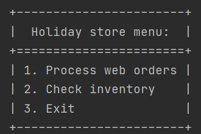

# COMP3522_Assignment2_A01165938_A01161142

## Todo
* add error handling - done
* add docstring to all classes - mina
* finish driver, store, order, orderProcesser classes - done
* make sure the variable names in each item's classes match the header of the excel sheet - done
* update class uml diagram - done
* create sequence uml diagram - mina, michelle
* readme.md - mina, michelle

## Overview
Holiday Store is an eCommerce store that sells holiday items. 

Currently, the holidays supported are 1) Easter, 2) Halloween, and 3) Christmas.

The store processes the orders, manages inventory, and records the order details for operational purposes.

Link to UML diagram: https://drive.google.com/file/d/1IQfRI85K167SCk_IT6fxkCsD_d1QSNYM/view?usp=sharing

Link to Sequence diagram: https://drive.google.com/file/d/1e6Kdx4njSJIQHWv16t7e9NjAmpHWKoS8/view?usp=sharing

## Features
  

|Feature|Description|
|---|---|
| Process Web Orders | User will be prompted to enter the file path to the excel file matching the requirements specified below. The program then will read the excel file and process the orders by searching the item in the inventory first, if the item does not exist in the inventory or the quantity is less than the order, it will automatically order 100 more of the item. |
| Check Inventory | Displays item information, such as Product ID, item name and the state in inventory in tabular form. Quantity over 10 is considered 'in-stock', over 3 is 'low', over 0 is 'very low' and 0 is 'out of stock' |
| Exit | The program automatically saves a file with the order details processed in current session, if there exists a file with identical name, a number gets appended to the end of the file name, e.g. filename_(1).txt |

## Items: attributes
In this program, we implemented a storefront that carries three main types of items: Toys, Stuffed Animals, and Candy. Each item type comes in three holiday-themed variations: Easter, Halloween, and Christmas. Each item, regardless of its item type or holiday theme, has a name, description, and product ID (which is a unique combination of both numbers and letters).
### Common item type attributes
#### Toys
Each Toy has the following properties:

* Whether the Toy is battery-operated or not
* A minimum recommended age of the child that the Toy is safe for

#### Stuffed Animals
Each Stuffed Animal has the following properties:

* Stuffing: one of Wool or Polyester Fiberfill
* Size: Small, Medium, or Large
* Fabric: can be either Linen, Acrylic, Cotton

#### Candy
Each Candy has the following properties:
* A flag to check whether the Candy contains nuts or not
* A flag to check if the Candy is lactose free or not

### Item-specific attributes
The following table displays the attributes for each specific item.

|  Item |  Item type  | Holiday theme | Item-specific attributes |
|---|---|---|---|
| Santa's Workshop | Toy | Christmas | Varies in dimensions (width, height) and number of rooms. Not battery operated
| Remote-Controlled (RC) Spider | Toy | Halloween | Varies in speed, jump height, some can glow in the dark, spider type (Tarantula or Wolf Spider). Is battery operated
| Robot Bunny | Toy | Easter | Varies in number of sound effects, colour (Orange, Blue, or Pink)
| Reindeer | Stuffed Animal | Christmas | Made out of Cotton and Wool stuffing. Has glow in the dark nose
| Dancing Skeleton | Stuffed Animal | Halloween | Made out of Acrylic yarn and Polyester Fiberfill stuffing. Glows in the dark
| Easter Bunny | Stuffed Animal | Easter | Made out of Linen and Polyester Fiberfill stuffing
| Candy Cane | Candy | Christmas | Lactose free, does not contain nuts. Stripes on the candy cane can be red or green
| Pumpkin Caramel Toffee | Candy | Halloween | Not lactose free, may contain traces of nuts. Two varieties available: Sea Salt, Regular
| Creme Eggs | Candy | Easter | Not lactose free, may contain traces of nuts. Creme eggs come in different packets that vary in number of creme eggs.

## Requirements and limitations
This program requires Python version 3.9.1.

Also, we used **pandas** in this assignment for reading item orders. It is a tool we used to read Excel files. To run our program for this assignment, you may need to install openpyxl. This can be done through pip via the command: `pip install openpyxl` in the command line.

You may also need to install the **Texttable** module. Texttable was used in formatting the program output.

A limitation of this program is that Excel files should be formatted a certain way to read the information. For example, please see the ["orders.xlsx" file](https://github.com/dlee533/COMP3522_Assignment2_A01165938_A01161142/blob/main/orders.xlsx) in this repo.
Another limitation is that the inputted order files should be in the Excel ".xlsx" format.
